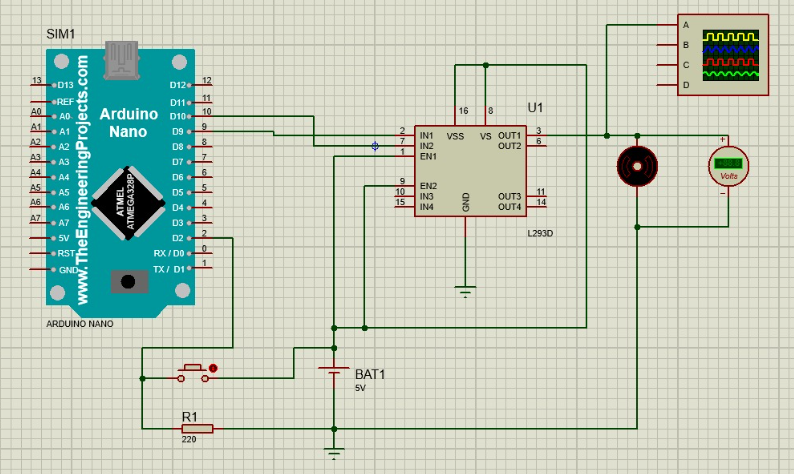

# Introdução ao PWM
PWM é a sigla para "Pulse Width Modulation", ou Modulação por Largura de Pulso. É uma técnica muito utilizada na eletrônica para controlar a potência de um sinal elétrico. Basicamente, PWM é uma forma de variar a largura de um pulso elétrico, mantendo a sua frequência constante. Essa variação na largura do pulso faz com que a média da tensão aplicada seja alterada, o que resulta em um controle de potência que pode ser utilizado em um motor elétrico por exemplo, o qual foi utilizado no projeto.

# Componentes necessários

**Utilizando a ferramenta Proteus:**

⚪ **Microcontrolador:** Arduino Nano;

⚪ **Ponte H:** modula os sinais recebidos pelo Arduino e transmite aos componentes necessários (Por exemplo, motor, led);

⚪ **Botão:** utilizado para alterar o valor de uma variável para controlar a velocidade do motor elétrico;

⚪ **Resistor:** utilizado para controlar a corrente elétrica;

⚪ **Motor elétrico:** utilizado para converter energia elétrica em energia mecanica;

⚪ **Voltímetro:** utilizado para visualizar a tensão da corrente elétrica;

⚪ **Osciloscópio:** utilizado para medir a amplitude da onda;

⚪ **Fonte 5V:** fornecer energia para alimentar o sistema;

# Esquemático

<div align=center>
<a href="https://github.com/MarcoAndradee">

</div>

# Código Fonte

```javascript
#include <Arduino.h>

int botao = 2;
int motor = 9;
int estado = 0;
int velocidade = 0;
unsigned long tempo_ref = 0;
unsigned long tempo_espera = 50;

void setup()
{
  pinMode(botao, INPUT_PULLUP);
  pinMode(motor, OUTPUT);
}
void loop()
{
  int aperto = digitalRead(botao);
  if (aperto != estado)
  {
    estado = aperto;
    if (aperto == HIGH)
    {
      tempo_ref = millis();
    }
    if (aperto == HIGH && ((millis() - tempo_ref) - tempo_espera))
    {
      velocidade += 63;
    }
    if (velocidade > 255)
    {
      velocidade = 0;
    }
    analogWrite(motor, velocidade);
  }
}
```

# Funcionamento do projeto

O projeto tem como objetivo utilizar o circuito com os componentes citados para controlar a velocidade um motor elétrico, na ferramenta Proteus, aonde utilizando um "Botão" é possível fazer esse controle a cada clique no botão, como por exemplo, o motor inicia no estado "0" que significa desligado, após o primeiro clique o motor vai para o estado "1" que significa ligado, porém em uma velocidade de 25%|100%, após outro clique a velocidade aumenta para 50%|100%, após outro clique a velocidade sobe para 75%|100% e após outro clique o motor fica com a velocidade total de 100%. Se for clicado mais uma vez o botão, volta o "loop" do código do circuito tornando o estado do motor "0" novamente e desligando-o, sendo possível repetir o processo quantas vezes for necessário. Em resumo, o objetivo do circuito é ter a possibilidade de controlar a velocidade de um motor elétrico em diferentes velocidades, podendo utilizar do mínimo até a máxima potência do mesmo.

<div align=center>
<a href="https://github.com/MarcoAndradee">

</div>